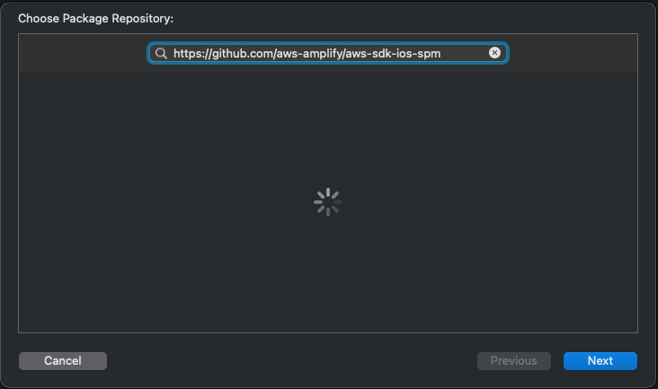

# AWS SDK for iOS Swift Package Manager support

We maintain the Swift Package Manager manifest (`Package.swift`) file for this library in a separate repo so that apps that use the SDK do not have to download the entire source repository in order to consume the binary targets.

The source URL for the SDK package is: https://github.com/aws-amplify/aws-sdk-ios-spm

See the [README](README.md) for instructions on installing the AWS Mobile SDK for iOS via Swift Package Manager.