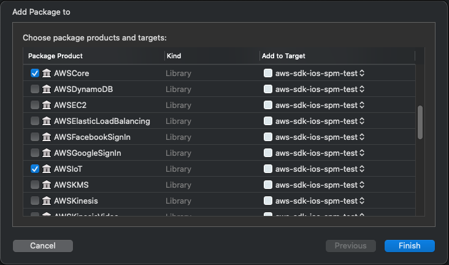

# Swift Package Manager support

The AWS Mobile SDK for iOS can be installed via Swift Package Manager, but you will have to import the target dependencies for each SDK you want to use.

Most SDKs only require you to import the SDK itself, and **AWSCore**:



However, some SDKs rely on other libraries in the SDK. The full list is below

| SDK | Dependencies | Notes |
| --- | ------------ | ----- |
| **AWSAPIGateway** | AWSCore |
| **AWSAppleSignIn** | AWSCore, AWSAuthCore | Only needed if you are using Sign In With Apple as an Identity Provider for Cognito Federated Identities (Cognito Identity Pools)
| **AWSAuth** | _Deprecated. Do not use this SDK._ |
| **AWSAuthCore** | AWSCore | 
| **AWSAuthUI** | AWSCore, AWSAuthCore | Used for native drop-in Auth UI
| **AWSAutoScaling** | AWSCore |
| **AWSCloudWatch** | AWSCore |
| **AWSCognitoAuth** | AWSCore, AWSCognitoIdentityProviderASF | Used for Cognito HostedUI
| **AWSCognitoIdentityProvider** | AWSCore, AWSCognitoIdentityProviderASF |
| **AWSCognitoIdentityProviderASF** |  |
| **AWSComprehend** | AWSCore |
| **AWSConnect** | AWSCore |
| **AWSConnectParticipant** | AWSCore |
| **AWSCore** |  |
| **AWSDynamoDB** | AWSCore |
| **AWSEC2** | AWSCore |
| **AWSElasticLoadBalancing** | AWSCore |
| **AWSFacebookSignIn** | AWSCore, AWSAuthCore, [FBSDKLoginKit from Facebook SDK](https://github.com/facebook/facebook-ios-sdk/) | Only needed if you are using Facebook as an Identity Provider for Cognito Federated Identities (Cognito Identity Pools).
| **AWSGoogleSignIn** | AWSCore, AWSAuthCore | Only needed if you are using Google as an Identity Provider for Cognito Federated Identities (Cognito Identity Pools)
| **AWSIoT** | AWSCore |
| **AWSKMS** | AWSCore |
| **AWSKinesis** | AWSCore |
| **AWSKinesisVideo** | AWSCore |
| **AWSKinesisVideoArchivedMedia** | AWSCore |
| **AWSKinesisVideoSignaling** | AWSCore |
| **AWSLambda** | AWSCore |
| **AWSLex** | AWSCore | _`arm64` architecture not supported due to an incompatibility with a packaged binary_
| **AWSLocationXCF** | AWSCore | See **XCFramework support** note below
| **AWSLogs** | AWSCore |
| **AWSMachineLearning** | AWSCore |
| **AWSMobileClientXCF** | AWSCore, AWSAuthCore, AWSCognitoIdentityProvider, AWSCognitoIdentityProviderASF | Add additional auth SDKs (e.g., **AWSUserPoolsSignIn** for native User Pools sign in, or **AWSCognitoAuth** for HostedUI) according to your use case. Also see **XCFramework support** note below.
| **AWSPinpoint** | AWSCore |
| **AWSPolly** | AWSCore |
| **AWSRekognition** | AWSCore |
| **AWSS3** | AWSCore |
| **AWSSES** | AWSCore |
| **AWSSNS** | AWSCore |
| **AWSSQS** | AWSCore |
| **AWSSageMakerRuntime** | AWSCore |
| **AWSSimpleDB** | AWSCore |
| **AWSTextract** | AWSCore |
| **AWSTranscribe** | AWSCore |
| **AWSTranscribeStreaming** | AWSCore |
| **AWSTranslate** | AWSCore |
| **AWSUserPoolsSignIn** | AWSCore, AWSAuthCore, AWSCognitoIdentityProvider, AWSCognitoIdentityProviderASF |

## XCFramework support

Some modules (**AWSLocation**, **AWSMobileClient**) are named with an `XCF` suffix to work around a [Swift issue](https://bugs.swift.org/browse/SR-11704). `AWSMobileClient` is named as `AWSMobileClientXCF` and `AWSLocation` is named as `AWSLocationXCF`. To use the `AWSMobileClient` or `AWSLocation` SDKs, import them as:

```swift
import AWSMobileClientXCF
import AWSLocationXCF
```

and use it your app code without the `XCF` suffix.

```swift
AWSMobileClient.default().initialize() 
let locationClient = AWSLocation.default()
```
